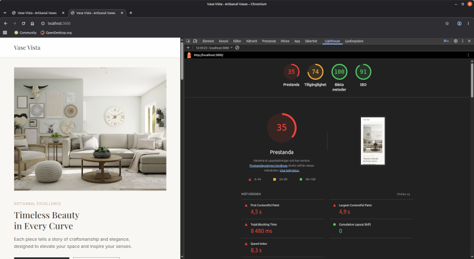
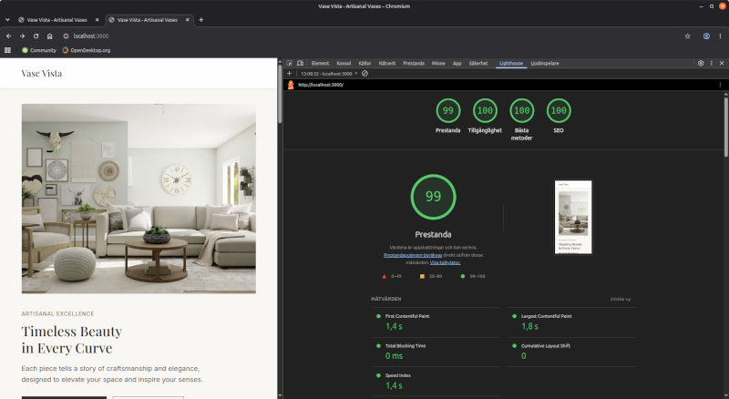
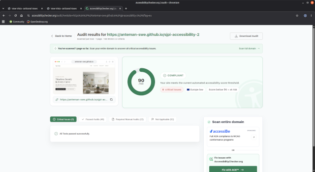

# sjpi-accessibility-2 - Save Our Site

**Skoluppgift i kursen Interaktionsdesign & användbarhet hos Lernia YH**  
En snygg webbsajt ("Vase Vista") är given men den har många dolda problem -
trasiga länkar, blockerande JavaScript, dålig kontrast, otillgängliga
interaktiva element m.m. Uppgiften var att hitta och åtgärda alla problem,
få grönt i alla kategorier i Google's verktyg Lighthouse och publicera sajten.

**Publicerad sajt (GitHub Pages):**  
<https://anteman-swe.github.io/sjpi-accessibility-2/>

## Dokument

- [RAPPORT.md](RAPPORT.md) - de fem värsta usability-problemen och hur de löstes
- [REFLEKTION.md](REFLEKTION.md) - reflektion över uppgiften

## Sammanfattning av åtgärderna

### index.html  

- `<html lang="en">` saknades (var bortkommenterad), det fanns dubbel `<title>`
- Trasiga nav-länkar till `404.html` har länkats till riktiga sidor  
- Dubbla `id="1"` och `tabindex="-1"` har tagits bort  
- Tom extra `<h1>` i hero-sektionen borttaget  
- Produkttitlar som började med `<h1>` och slutade `</h3>` har rättats till `<h3>`
- `
` som knapp i filtret har gjorts om till riktiga `<button>` med `aria-pressed`
- `
` i footern har gjorts om till riktiga `<a>`; `href="#"` och alla länkar pekar nu till giltiga mål
- Alt-texter som saknades har lagts  till alla bilder  
- Två trasiga bild-URL:er som gav 404 har ersatts med fungerande URL:er
- Bilder: `loading="lazy"`, `width`/`height`, mindre storlekar
- Nyhetsbrevsfältet fick en `<label>`, `name`, `autocomplete` och status-yta
- Blockquote i stället för `<a>` utan href; skip-länk till huvudinnehållet

### styles.css  

- Terracotta-färgen mörkad för att öka kontrasten från ca 2.3:1 till att hamna i intervallet 5.1-5.7:1 för att stämma överens med WCAG
- `outline: none` på fokus-element, t ex knappar har ersatts med tydliga `:focus-visible`-stilar
- Footer-texter har gjorts ljusare för att öka kontrasten  
- `prefers-reduced-motion`, skip-länk, `.sr-only`, `scroll-margin-top` förankade sektioner

### script.js  

- Blockerande kod helt borttagen: busy-wait 1 s var 3:e sekund, 110 000 `console.log`,
  bakåtknappsfälla (`history.pushState`/`onpopstate`), 5-sekundersfördröjning av body
- Ny, icke-blockerande logik: produktfilter + formulärbekräftelse

### Nya filer  

- `privacy.html` / `terms.html` (ersätter länkar till saknad 404-sida)
- `.github/workflows/deploy.yml` som automatiskt publicerar sajten till GitHub Pages vid push till main

## Om du vill testa själv

1. Öppna sajten i Chrome och kör **Lighthouse** (DevTools -> Lighthouse -> alla kategorier).
2. Testa tangentbordsnavigering: Tab syns tydligt, skip-länk kommer först, filtret går att
   använda med Enter/Space.
3. Kör en online-analys, t.ex. <https://www.accessibilitychecker.org/> på den publicerade URL:en.

### Lighthouse före åtgärder  

  

### Lighthouse efter åtgärder  

### Analys med Accessibilitychecker.org

